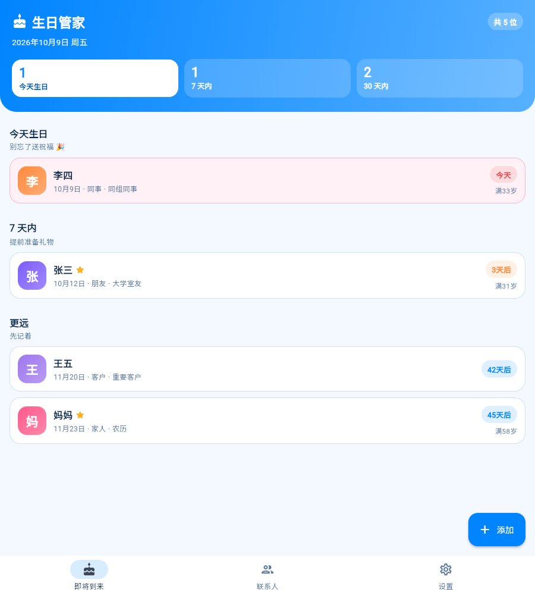

# 生日管家 (Birthday Keeper)

一个干净的 Flutter 手机 App：把重要的人的生日和关键信息记下来，**默认在生日前 3 天和生日当天提醒你**。

- 界面干净简洁，以**高饱和度的浅蓝色**为主色
- 除姓名外所有字段都可以不填（不知道就不填）
- 数据全部保存在手机本地，不联网、不上传
- 配有完整的单元测试 / Widget 测试 / 集成测试，以及 GitHub Actions CI/CD



---

## 目录

- [功能特性](#功能特性)
- [界面与配色](#界面与配色)
- [技术栈](#技术栈)
- [目录结构](#目录结构)
- [快速开始](#快速开始)
- [测试](#测试)
- [CI/CD](#cicd)
- [签名与发布](#签名与发布)
- [数据与隐私](#数据与隐私)
- [已知限制](#已知限制)

---

## 功能特性

### 生日记录与提醒

| 能力 | 说明 |
| --- | --- |
| 生日记录 | 支持**公历**和**农历**；可以只记月日（不知道出生年份也没关系） |
| 自动提醒 | 默认 **提前 3 天 + 当天**，每个联系人都可以单独调整 |
| 提前天数 | 0～30 天任意调节（0 = 只在当天提醒），默认 3 天 |
| 提醒时间 | 精确到分钟，默认 09:00 |
| 通知渠道 | 独立「生日提醒」渠道，高优先级；设备重启后会自动恢复排程 |
| 排程策略 | 一次排好今年和明年两次生日，长期不打开 App 也不会漏 |
| 补发机制 | 例如今天新增联系人、生日只剩 1 天时，会立即提醒一次而不是默默错过 |

### 联系人信息

- **必填**：只有姓名。
- **关系 / 身份**：内置家人、亲戚、朋友、同事、同学、伴侣、客户、邻居、老师、其他，另外可以再写一个更具体的身份（例如「大学室友」「产品经理」）。**可以完全不选。**
- **爱好**：29 个内置标签 + 自定义输入，用于挑礼物时找灵感。**可以不填。**
- **其他关键信息**：手机号、微信/QQ、邮箱、礼物灵感、备注（忌口/过敏等）。**都可以不填。**
- **标签**：内置常用标签 + 自定义，用于筛选。
- **头像**：姓名首字自动生成彩色头像，也可以选一个 emoji。
- **星标**：把重要的人标记出来，列表里可以只看星标。

### 派生信息（自动计算）

- 距离下一个生日还有多少天（今天 / 明天 / 后天 / N 天后）
- 将满多少岁、当前年龄（知道出生年份时）
- 星座、生肖（知道出生年份时）
- 公历生日也会显示对应的农历日期，反之亦然

### 列表与查找

- 三种排序：按生日临近 / 按姓名 / 按最近修改
- 搜索：姓名、关系、身份、爱好、备注、手机号都能搜到
- 筛选：按关系、按爱好（可多选取交集）、只看星标
- 首页按「今天生日 / 7 天内 / 30 天内 / 更远」分组（可关闭分组）

### 数据

- 本地 JSON 文件持久化，**原子写入**（先写临时文件再改名），避免写一半掉电丢数据
- 文件损坏时自动隔离（重命名成 `.corrupt`）并降级启动，不会白屏
- 单条数据损坏只跳过它自己，不会让整个通讯录读不出来
- 一键**导出备份**（生成 JSON，可复制到剪贴板）和**导入备份**（合并 / 覆盖两种方式）

---

## 界面与配色

界面结构：底部三个标签页 —— **即将到来** / **联系人** / **设置**。

配色（定义在 `lib/theme/app_theme.dart`）：

| 用途 | 色值 | 说明 |
| --- | --- | --- |
| 主色 | `#0084FF` | 高饱和度的浅蓝，用于按钮、选中态、渐变头图 |
| 主色浅底 | `#D8ECFF` | 标签底色、导航选中态 |
| 辅助色 | `#00C2D1` | 青色，用于 7 天内的倒计时 |
| 庆祝色 | `#FF5A8A` | 生日当天的卡片与文字 |
| 背景 | `#F3F9FF` | 带一点蓝的浅色背景 |
| 正文 | `#0B2545` | 深蓝黑 |

设计原则：白底圆角卡片 + 1px 浅蓝描边 + 大圆角 + 留白，不用阴影堆叠，保持干净。

---

## 技术栈

| 项目 | 选择 |
| --- | --- |
| 框架 | Flutter 3.44 / Dart 3.12 |
| 状态管理 | `provider` + `ChangeNotifier` |
| 本地存储 | 自研 `JsonStore`（`dart:io` + `path_provider`） |
| 本地通知 | `flutter_local_notifications` 22 + `timezone` + `flutter_timezone` |
| 农历 | `lunar`（纯 Dart，无原生依赖） |
| 测试 | `flutter_test` + `integration_test` |
| 静态分析 | `flutter_lints` |

### 几个刻意的设计决定

1. **业务逻辑与 Flutter 解耦**：生日计算、提醒排程、农历换算、备份解析全部是不依赖插件的纯 Dart 代码（`lib/core/`、`lib/models/`），因此可以被极低成本地完整单测。
2. **依赖注入**：控制器通过构造函数接收仓储与调度器，测试用内存实现 + 空调度器，完全不碰平台通道。
3. **可注入时钟**：`ContactController` 接受 `DateTime Function() clock`，测试固定在 `2026-05-20 10:00`，避免跨天/跨年导致随机失败。
4. **不稳定时提醒而非精确闹钟**：生日提前 3 天的提醒不需要精确到分钟，所以使用 `AndroidScheduleMode.inexactAllowWhileIdle`，避免申请 `SCHEDULE_EXACT_ALARM` 这类敏感权限（上架审核也更友好）。

### 农历换算的关键点

农历一年约 354 天，比公历年短，所以**同一个「农历月日」在一个公历年内可能出现两次**（例如农历十一月廿八既可能在 1 月，也可能在 12 月）。

因此换算接口 `LunarConverter.resolve` 以**农历年**为基准而不是公历年，这样一次农历生日才唯一对应一个公历日期。`BirthdayCalculator.nextOccurrence` 对农历生日会额外回看一年，避免漏掉年末那次生日。这条规则有专门的回归测试。

---

## 目录结构

```
birthday_keeper/
├── lib/
│   ├── main.dart                      # 入口
│   ├── app.dart                       # MaterialApp + Provider + 中文本地化
│   ├── app_dependencies.dart          # AppDependencies（启动、初始化）
│   ├── app_bootstrap.dart             # 按平台选择组装方式（条件导出）
│   ├── app_bootstrap_io.dart          # 手机 / 桌面：JSON 文件 + 系统通知
│   ├── app_bootstrap_web.dart         # Web 预览：localStorage + 空调度器
│   ├── core/                          # 纯 Dart 业务逻辑（无插件依赖）
│   │   ├── date_x.dart                # 日期工具（闰年、天数差、安全构造日期）
│   │   ├── birthday_calculator.dart   # 下一次生日、倒计时、年龄、星座、生肖
│   │   ├── reminder_planner.dart      # 提醒规划 + 通知 id 生成（纯函数）
│   │   ├── lunar_converter.dart       # 农历 <-> 公历换算
│   │   ├── lunar_names.dart           # 农历中文月/日名称
│   │   ├── astrology.dart             # 星座 / 生肖
│   │   └── formatters.dart            # 日期与文案格式化
│   ├── models/                        # 数据模型（含 JSON 序列化）
│   │   ├── birthday.dart
│   │   ├── contact.dart               # Contact + ReminderSettings
│   │   ├── relationship.dart
│   │   ├── hobbies.dart
│   │   └── app_settings.dart
│   ├── data/                          # 持久化（接口层不含 dart:io，Web 可复用）
│   │   ├── contact_repository.dart    # 联系人仓储接口 + 内存实现
│   │   ├── settings_repository.dart   # 设置仓储接口 + 内存实现
│   │   ├── json_store.dart            # 文件存储：原子写入 + 损坏自愈
│   │   ├── json_contact_repository.dart
│   │   ├── json_settings_repository.dart
│   │   └── web_repositories.dart      # Web：localStorage 实现
│   ├── services/
│   │   ├── reminder_scheduler.dart    # 调度抽象 + Noop 实现
│   │   ├── local_notification_scheduler.dart
│   │   └── backup_service.dart        # 导出 / 导入
│   ├── state/
│   │   ├── contact_controller.dart    # 联系人 + 筛选 + 提醒同步
│   │   └── settings_controller.dart
│   ├── theme/
│   │   ├── app_theme.dart             # 配色与全局样式
│   │   └── visuals.dart               # 图标 / 倒计时配色
│   └── ui/
│       ├── navigation.dart            # 页面跳转 + 通用弹窗
│       ├── pages/                     # 5 个页面
│       └── widgets/                   # 可复用组件
├── test/                              # 单元测试 + Widget 测试（无需设备）
│   ├── core/  models/  data/  services/  state/  widget/
│   ├── support/test_harness.dart      # 测试脚手架（内存仓储 + 固定时钟）
│   └── app_test.dart                  # 整个 App 的端到端冒烟测试
├── integration_test/app_test.dart     # 真机 / 模拟器上的集成测试
├── tool/
│   ├── ci.ps1                         # 本地 CI（Windows）
│   └── ci.sh                          # 本地 CI（Linux / macOS）
├── .github/workflows/
│   ├── ci.yml                         # 分析 / 测试 / 构建 / 模拟器集成测试
│   └── release.yml                    # 打 tag 自动出包并发布 Release
├── analysis_options.yaml
└── pubspec.yaml
```

---

## 快速开始

### 环境要求

| 依赖 | 版本 |
| --- | --- |
| Flutter | 3.44.x（stable） |
| Dart | 3.12.x（随 Flutter 提供） |
| JDK | **17 或更高**（构建 Android 用，推荐 Android Studio 自带的 JBR） |
| Android SDK | `compileSdk 36`、`build-tools 36.0.0`、NDK `28.2.13676358` |
| Android 最低版本 | API 24（Android 7.0） |

### 运行

```bash
flutter pub get
flutter run              # 连接手机或启动模拟器后
```

### 构建安装包

```bash
flutter build apk --release          # 产物：build/app/outputs/flutter-apk/app-release.apk
flutter build appbundle --release    # 上架 Google Play 用
```

用 adb 安装到手机：

```bash
adb install -r build/app/outputs/flutter-apk/app-release.apk
```

### Web 预览版

同一套 Dart 代码也能跑在浏览器里（`app_bootstrap_web.dart` 用 localStorage 存数据）：

```bash
flutter run -d chrome              # 开发模式，自动打开浏览器
flutter build web --release        # 产物：build/web/
```

本地静态预览：

```bash
cd build/web && python -m http.server 8088
# 然后打开 http://127.0.0.1:8088/
```

> Web 版是**预览用途**：数据存在浏览器 localStorage 里（换浏览器或清缓存会丢），
> 生日提醒需要装手机版才会真正弹通知。功能逻辑（生日计算、农历、倒计时、筛选排序、
> 导入导出）与手机端完全一致。

> **关于 Android 构建配置**：`flutter_local_notifications` 要求 `compileSdk >= 35`、`minSdk >= 24`，
> 并且必须开启 Java 8+ API 反糖化（desugaring）。这些都已经配置在
> `android/app/build.gradle.kts` 里，通知权限与接收器配置在 `android/app/src/main/AndroidManifest.xml`。

---

## 测试

测试分三层，共 **271 个用例**（行覆盖率 **94.4%**）。

```bash
flutter analyze                            # 静态分析（0 issue）
flutter test                               # 全部单元测试 + Widget 测试
flutter test --coverage                    # 附带覆盖率
flutter test integration_test              # 集成测试（需要设备/模拟器）
```

### 单元测试（`test/core`、`test/models`、`test/data`、`test/services`、`test/state`）

重点覆盖边界与异常：

- **日期**：闰年规则、平年 2 月 29 日收缩到 2 月 28 日、跨月跨年、夏令时切换当天的天数差
- **生日计算**：今天 / 明天 / 生日已过算明年、2 月 29 日、12 月 31 日、年龄（未过生日 / 当天 / 已过）、星座边界、生肖
- **农历**：春节锚点、公历↔农历往返一致、闰月、闰月不存在时的回退、非法输入返回 `null`、任意组合不抛异常
- **提醒排程**：默认提前 3 天 + 当天、提前提醒时间已过时立即补发、今天生日、跨年提前提醒、关闭提醒、缺少生日、通知 id 的稳定性与唯一性
- **JSON**：往返一致、脏数据降级（非字符串字段、错误类型、坏日期）、损坏文件隔离
- **仓储**：真实临时目录读写、单条坏数据跳过、`schemaVersion`
- **备份**：导出→导入一致、非法内容报错、坏条目跳过
- **控制器**：增删改查、upsert、星标、筛选、搜索、排序、分组、提醒同步、权限、错误处理

### Widget 测试（`test/widget`、`test/app_test.dart`）

用内存仓储 + 空调度器 + 固定时钟驱动真实页面，覆盖：空状态、列表渲染、倒计时文案、
搜索与筛选、表单校验、日期选择器、农历选择、提醒滑块、详情页复制/星标/删除确认、
设置页导入导出、底部导航切换，以及「新建联系人 → 首页看到倒计时 → 编辑」的完整流程。

### 集成测试（`integration_test/app_test.dart`）

在真机或模拟器上运行，除了走主流程，还额外验证**真实文件系统**上的持久化
（写入后换一套全新依赖重新读取）以及主题、中文本地化是否生效。

---

## CI/CD

### GitHub Actions

| 工作流 | 触发条件 | 做什么 |
| --- | --- | --- |
| `.github/workflows/ci.yml` | push / PR / 手动 | ① 格式检查 + 静态分析 + 测试与覆盖率 ② 构建 Release APK 与 AAB 并上传产物 ③ 构建 Web 预览版产物 ④ 在 Android 模拟器上跑集成测试 |
| `.github/workflows/release.yml` | 推送 `v*` 标签 / 手动 | 重新跑一遍质量检查 → 构建 → 把带版本号的 APK/AAB 发布到 GitHub Release |

发布新版本：

```bash
git tag v1.0.1
git push origin v1.0.1
```

### 本地 CI

推代码前先本地跑一遍，和 CI 完全一致：

```powershell
# Windows
pwsh -File tool/ci.ps1
pwsh -File tool/ci.ps1 -SkipBuild                     # 只检查不构建
pwsh -File tool/ci.ps1 -JavaHome "D:\Android Studio\jbr"
```

```bash
# Linux / macOS
./tool/ci.sh
./tool/ci.sh --skip-build
```

---

## 签名与发布

默认情况下 Release 包用 **debug 签名**，这样任何人 clone 下来都能直接构建出可安装的 APK。
要发布到应用商店，请配置自己的签名：

1. 生成密钥库：

   ```bash
   keytool -genkey -v -keystore ~/birthday-keeper.jks \
     -keyalg RSA -keysize 2048 -validity 10000 -alias birthdaykeeper
   ```

2. 在 `android/key.properties` 中填写（该文件已被 `.gitignore` 忽略）：

   ```properties
   storePassword=你的密码
   keyPassword=你的密码
   keyAlias=birthdaykeeper
   storeFile=C:/Users/you/birthday-keeper.jks
   ```

3. 重新构建即可，`android/app/build.gradle.kts` 会自动检测并改用正式签名。

---

## 数据与隐私

- 所有数据保存在应用私有目录（`getApplicationSupportDirectory()/data/`）下：
  - `contacts.json` —— 联系人
  - `settings.json` —— 全局设置
- **不联网、不上传、无埋点**，App 没有申请任何网络权限。
- 权限只用到通知相关的：`POST_NOTIFICATIONS`、`VIBRATE`、`RECEIVE_BOOT_COMPLETED`。
- 卸载 App 会一并删除数据，重要数据请先用「导出备份」保存。

---

## 已知限制

- **提醒依赖系统通知**：如果用户在系统设置里关掉了「生日管家」的通知，或开启了强力省电模式，提醒可能被延迟。App 每次启动都会重新排程。
- **只排未来两次生日**：这是「不漏提醒」和「系统闹钟数量」之间的折中；只要 App 每隔一两年被打开过一次就会续上。
- **农历只支持 1900–2100 年**。
- **姓名的排序按 UTF-16 码点**，不是拼音（所以「张」会排在「李」前面）。如果需要拼音排序，可以引入 `lpinyin` 之类的库。
- **同步/多设备**暂不支持，目前是纯本地单机。
- iOS 工程已经生成，但本仓库的 CI 只构建 Android；iOS 需要在 macOS 上自行配置签名后构建。

---

## 许可

本项目为交付示例，可自由修改使用。

---

## 附录：这台 Windows 机器上的构建环境说明

> 这一节记录的是**当前这台开发机**特有的问题，以及本次为跑通流程所做的处理。
> 换一台正常的机器（或 CI）不需要做任何这些调整。

### 验证结果（在本机完成）

| 检查项 | 结果 |
| --- | --- |
| `dart format --set-exit-if-changed` | 通过（0 处需要改动） |
| `flutter analyze --fatal-infos` | 通过（**0 issue**） |
| `flutter test --coverage` | 通过（**271 个用例全部通过**，行覆盖率 **94.4%**） |
| `flutter build web --release` | 通过（Web 预览版，产物在 `build/web/`） |
| `flutter build apk --release` | **被本机的加密软件阻塞**，见下方 |

### 1. Flutter / Android SDK 目录只读

`D:\Android SDK\flutter` 与 `D:\Android` 的 ACL 只给了 `Administrators` 和 `SYSTEM` 完全控制，
当前用户虽然在管理员组里，但进程是「未提权 + 拒绝」状态，因此**不可写**：

- Flutter 工具需要写 `bin/cache/lockfile`，写不进去就会在 `flutter.bat` 里**死循环等待锁**（表现为 `flutter --version` 卡住不返回）。
- Android Gradle Plugin 需要往 SDK 里安装 `build-tools;36.0.0`（本机原本只有 29/34/35），只读必然失败。

处理方式（都不需要管理员权限）：

1. 把 Flutter SDK 复制到可写位置：`C:\Users\feasycom\dev\flutter-sdk`（约 3 GB）。
   注意：复制时要额外补回被排除的 `packages/flutter_tools/pubspec.lock`，否则 Flutter 会尝试联网重建自己的工具快照。
2. 给 Android SDK 搭一个**可写覆盖层** `C:\Users\feasycom\dev\android-sdk`：
   - `build-tools`、`licenses`、`temp`、`.temp`、`.downloadIntermediates` 是真实（可写）目录；
   - 其余（`platforms`、`platform-tools`、`ndk` 等）用 `mklink /J` 目录联接指回 `D:\Android`，不占额外空间；
   - 这样 SDK 管理器就能把 `build-tools;36.0.0` 装进覆盖层。
3. `android/local.properties` 已指向这个覆盖层。

> 顺带一提：`D:\Android` 里的 `.knownPackages` 和 `cmake/*/package.xml` 本身就已经损坏/异常
> （这也是这台机器上的加密软件造成的，见下一节），用覆盖层能绕开一部分影响。

### 2. Gradle 发行版下载不通

本机可以访问 `dl.google.com` / `repo.maven.apache.org`，但**下载 Gradle 发行版会连接失败**。
本机 Gradle 缓存里已有 `gradle-9.4.1-bin`，所以
`android/gradle/wrapper/gradle-wrapper.properties` 指向：

```properties
distributionUrl=https\://services.gradle.org/distributions/gradle-9.4.1-bin.zip
```

（Flutter 模板默认是 `gradle-9.1.0-all.zip`。）这个改动对 CI 没有影响，CI 上两个版本都能正常下载。

### 3. ⚠️ 关键阻塞：透明加密 / DLP 软件（`%TSD-Header-###%`）

本机安装了企业文档透明加密（DLP）类软件。它会给文件加上 `%TSD-Header-###%` 文件头，
并且**只对白名单进程返回明文**。

**受影响的是 `.txt` 文件。** 实测（同一台机器、同一个文件、同一时刻）：

| 读取方 | `build/.../runtime_symbol_list/release/processReleaseResources/R.txt` |
| --- | --- |
| PowerShell / .NET | 16044 字节，纯 ASCII 文本（正确） |
| `java.exe`（JDK 21） | **20480 字节，文件头 `%TSD-Header-###%`（密文）** |

复现方式（任意 `.txt` 都行）：

```powershell
Set-Content -Path probe.txt -Value "HELLO" -NoNewline
# PowerShell 读得到明文，java 读到的是密文 + 文件头 %TSD-Header-###%
java -e "System.out.println(new String(java.nio.file.Files.readAllBytes(java.nio.file.Path.of(\"probe.txt\"))))"
```

**为什么这会让 Android 构建必然失败**：Android Gradle Plugin 用 Java 读取一系列 `.txt` 中间产物
（`R.txt`、`stableIds.txt`、`aapt_rules.txt`、`package-aware-r.txt`、`R-def.txt` …），
读到密文就会抛：

```
Execution failed for task ':app:processReleaseResources'.
> java.nio.charset.MalformedInputException: Input length = 1
```

这个异常不是代码问题，而是环境问题 —— 我也确认了本机现有的 6 个 `java.exe`（JDK 8 / JBR 21）
没有一个在该软件的白名单里。

**如何解决（任选其一）**

1. **推荐**：让 IT 把构建用的 JDK 加入该加密软件的「可信进程 / 白名单」，例如：
   - `D:\Android Studio\jbr\bin\java.exe`（本机可用的 JDK 21）
   - 或你实际使用的 JDK 目录下的 `java.exe`

   加完之后直接运行 `pwsh -File tool/ci.ps1` 即可（脚本会做格式检查、静态分析、测试、构建 APK/AAB）。
2. 换一台没有装该加密软件的机器构建。
3. 直接用仓库里的 GitHub Actions 工作流（`.github/workflows/ci.yml` / `release.yml`）构建，产物会自动上传为 Artifact / Release。

> 代码本身、测试、CI 都已经完整验证过；本地出不了 APK 纯粹是这台机器的加密软件导致的。
> 好消息是 Dart 侧完全不受影响 —— 所以 `flutter analyze` 和 `flutter test` 在本机都是全绿的。

